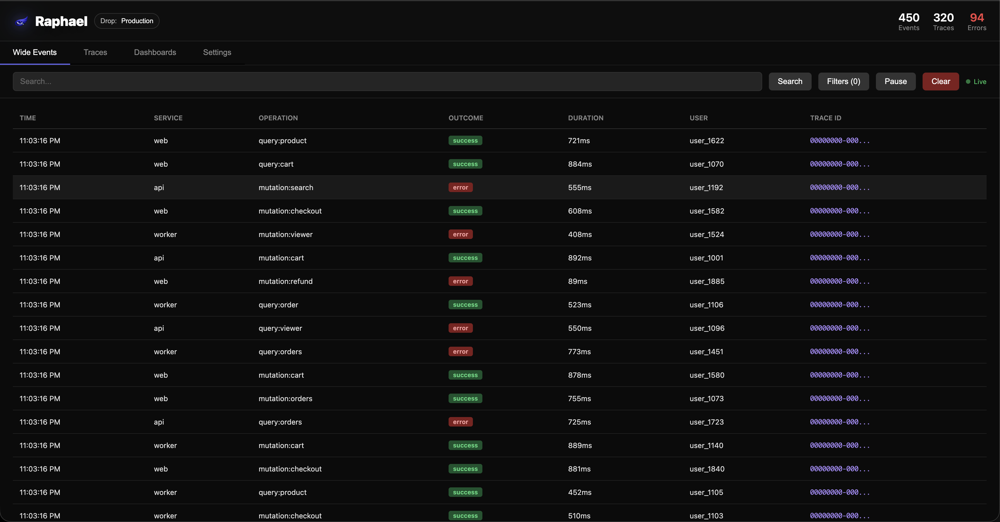
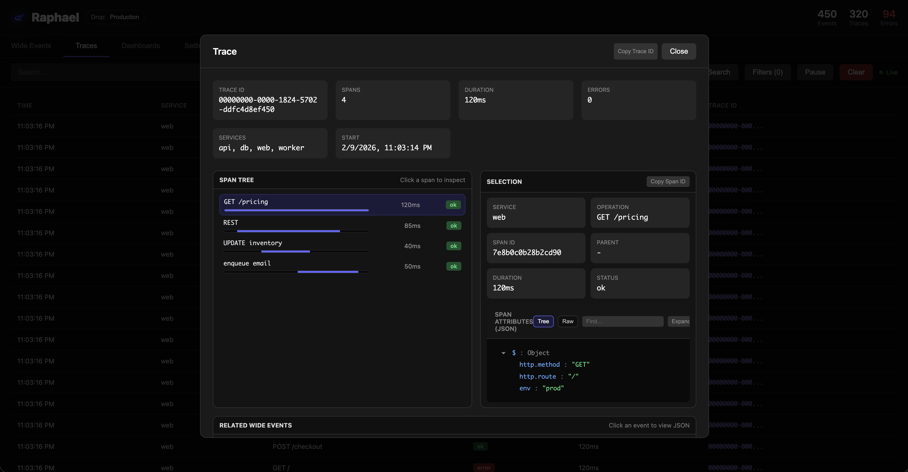
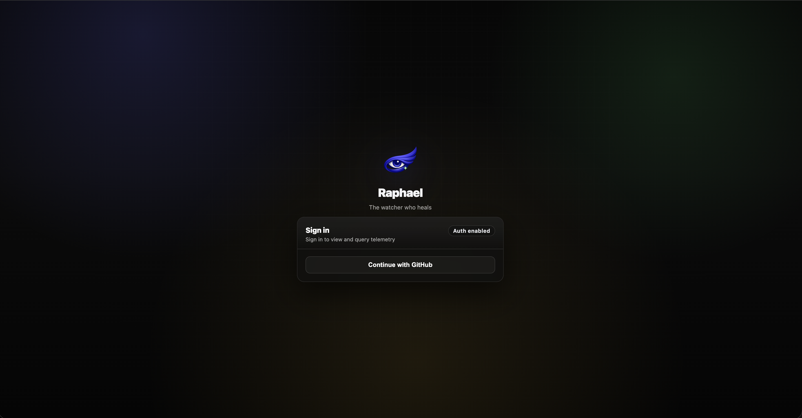

# Raphael

**The Watcher Who Heals**

A lightweight, local trace and wide event viewer for debugging distributed systems. Raphael watches over your services and helps you diagnose issues with real-time telemetry visualization.

## Features

- **OpenTelemetry Compatible** - Accepts OTLP HTTP JSON traces
- **Wide Events** - First-class support for structured business events
- **Real-time Updates** - WebSocket-powered live streaming
- **Zero Configuration** - Works with any service that can send HTTP requests
- **SQLite Storage** - Persistent, lightweight, no external dependencies
- **Search** - Query traces and events by service, operation, user, or attributes

## Why Another Observability Tool?

Most observability stacks optimize for production scale, configurability, and long-term analysis. When you are debugging locally (or iterating with an AI agent), that often turns into too many screens, too many knobs, and too much cognitive overhead.

Raphael is intentionally straight to the point:

- **Fast path to answers** - Get from "something is broken" to "here is the trace/event and why" quickly.
- **Low cognitive load** - A small set of concepts that map to how debugging actually happens.
- **Local-first UX** - Sensible defaults, minimal configuration, and a UI that stays out of your way.

## Screenshots

### Wide Events



### Trace Drilldown



### Wide Event Detail


### Dashboards



### GitHub OAuth Sign-In (Optional)


## Quick Start

### Using Docker (Recommended)

```bash
docker compose up -d
```

Raphael will be available at `http://localhost:6274`

### Using Node.js

```bash
npm install
npm run dev
```

## Endpoints

| Endpoint | Method | Format | Description |
|----------|--------|--------|-------------|
| `/v1/traces` | POST | OTLP JSON | Ingest OpenTelemetry traces |
| `/v1/events` | POST | JSON | Ingest wide events (simple format) |
| `/v1/logs` | POST | OTLP JSON | Ingest wide events (OTLP logs format) |
| `/v1/query/traces` | POST | JSON | Query traces (rich filters) |
| `/v1/query/events` | POST | JSON | Query wide events (rich filters) |
| `/v1/query/traces/:traceId` | GET | JSON | Get all spans and events for a trace |

### Sending Traces (OTLP Format)

```bash
curl -X POST http://localhost:6274/v1/traces \
  -H "Content-Type: application/json" \
  -d '{
    "resourceSpans": [{
      "resource": {
        "attributes": [{"key": "service.name", "value": {"stringValue": "my-service"}}]
      },
      "scopeSpans": [{
        "spans": [{
          "traceId": "abc123...",
          "spanId": "def456...",
          "name": "GET /users",
          "startTimeUnixNano": "1704067200000000000",
          "endTimeUnixNano": "1704067200100000000"
        }]
      }]
    }]
  }'
```

### Sending Wide Events (Simple Format)

```bash
curl -X POST http://localhost:6274/v1/events \
  -H "Content-Type: application/json" \
  -d '{
    "trace_id": "abc-123",
    "service.name": "api-gateway",
    "graphql.operation_type": "query",
    "graphql.field_name": "getUsers",
    "outcome": "success",
    "duration.total_ms": 150,
    "user.id": "user-456",
    "error_count": 0,
    "count.rpc_calls": 3
  }'
```

## API

| Endpoint | Method | Description |
|----------|--------|-------------|
| `/api/traces` | GET | List recent traces |
| `/api/events` | GET | List recent wide events |
| `/api/traces/:traceId` | GET | Get all spans and events for a trace |
| `/api/search/traces?q=` | GET | Search traces |
| `/api/search/events?q=` | GET | Search wide events |
| `/api/stats` | GET | Get counts for traces, events, and errors |
| `/api/clear` | DELETE | Clear all data (admin only when auth is enabled) |
| `/api/drops` | GET | List drops (when auth is enabled, only drops you can query) |
| `/api/drops` | POST | Create a drop (admin only when auth is enabled) |
| `/api/drops/:dropId/retention` | PUT | Update per-drop retention (admin only when auth is enabled) |
| `/api/drops/:dropId/label` | PUT | Update a drop label (admin only when auth is enabled) |
| `/api/drops/:dropId` | DELETE | Delete a drop and all its data (admin only when auth is enabled) |
| `/api/auth/config` | GET | Auth configuration summary for the UI |
| `/api/auth/*` | POST/GET | BetterAuth endpoints (sign-in, callbacks, sessions) |
| `/api/admin/*` | GET/POST/PATCH/DELETE | Admin endpoints (users, per-user drop permissions, OAuth allowlist policy; only meaningful when auth is enabled) |
| `/api/account/*` | GET/POST/DELETE | Account endpoints (mine-only service accounts, API keys, usage; session required; only available when auth is enabled) |

## Configuration

| Environment Variable | Default | Description |
|---------------------|---------|-------------|
| `PORT` | `6274` | Server port |
| `RAPHAEL_DB_PATH` | `./data/raphael.db` | SQLite database path |
| `RAPHAEL_AUTH_ENABLED` | `false` | Enable auth (sessions + API keys) |
| `RAPHAEL_AUTH_EMAIL_PASSWORD_ENABLED` | `false` | Enable email/password login |
| `RAPHAEL_ADMIN_EMAIL` | `""` | Promote this email to admin on sign-in |
| `RAPHAEL_ADMIN_PASSWORD` | `""` | Seed/update admin password (email/password only) |
| `RAPHAEL_AUTH_SESSION_TTL_HOURS` | `168` | Session duration in hours |
| `RAPHAEL_AUTH_TRUSTED_ORIGINS` | `""` | Comma-separated trusted origins for auth |
| `RAPHAEL_AUTH_GOOGLE_CLIENT_ID` | `""` | Google OAuth client id |
| `RAPHAEL_AUTH_GOOGLE_CLIENT_SECRET` | `""` | Google OAuth client secret |
| `RAPHAEL_AUTH_GITHUB_CLIENT_ID` | `""` | GitHub OAuth client id |
| `RAPHAEL_AUTH_GITHUB_CLIENT_SECRET` | `""` | GitHub OAuth client secret |
| `RAPHAEL_AUTH_AZURE_TENANT_ID` | `""` | Azure Entra tenant id |
| `RAPHAEL_AUTH_AZURE_CLIENT_ID` | `""` | Azure Entra client id |
| `RAPHAEL_AUTH_AZURE_CLIENT_SECRET` | `""` | Azure Entra client secret |
| `RAPHAEL_AUTH_GENERIC_OAUTH` | `""` | JSON array of generic OAuth providers |
| `BETTER_AUTH_SECRET` | `""` | Required in production, 32+ chars |
| `BETTER_AUTH_BASE_URL` | `""` | Base URL for OAuth callbacks and redirects (recommended) |
| `BETTER_AUTH_URL` | `""` | Legacy base URL env var (fallback) |
| `RAPHAEL_SQLITE_SYNCHRONOUS` | `NORMAL` | SQLite durability vs throughput (`FULL`, `NORMAL`, `OFF`) |
| `RAPHAEL_SQLITE_BUSY_TIMEOUT_MS` | `5000` | SQLite busy timeout (reduces transient “database is locked”) |
| `RAPHAEL_SQLITE_WAL_AUTOCHECKPOINT_PAGES` | `1000` | WAL autocheckpoint pages (prevents unbounded WAL growth) |
| `RAPHAEL_INGEST_BROADCAST_MAX_ITEMS` | `500` | Max rows broadcast per ingest request (caps WS payload size) |
| `RAPHAEL_INGEST_BROADCAST_BATCH_SIZE` | `200` | Rows per WebSocket message (batches WS frames) |
| `RAPHAEL_PRUNE_BATCH_SIZE` | `5000` | Retention delete batch size (chunked deletes) |
| `RAPHAEL_PRUNE_MAX_RUNTIME_MS` | `250` | Time budget per pruning run (avoids long write locks) |

## Hosting Raphael

See `docs/hosting.md` for a simple Docker hosting setup (non-root, read-only rootfs, auth/TLS guidance).

## Tech Stack

- **Backend**: Node.js, Express, better-sqlite3, WebSocket
- **Frontend**: React 19, Vite
- **Database**: SQLite with WAL mode

## Roadmap

- [x] **Smart Filtering** - Refine log filter UX with auto-detection of high-cardinality fields (50+ entries) to generate filter options, while preserving selected filters as logs stream in
- [x] **Enhanced Viewers** - Code editor-style JSON view for traces and events with collapsible blocks
- [x] **Dashboards** - One-click dashboard creation from logs with full drag, drop, and resize support
- [x] **Drops** - Workspace/container separation layer to isolate logs from different environments (e.g., staging vs production)
- [x] **Auto-Truncation Rules** - Minimal retention rules per Drop to prevent unbounded growth (e.g., "Drop A: traces 3d, events 7d")
- [x] **Auth Layer** - Optional authentication for hosted deployments, with API key generation (R/W permissions per Drop per endpoint)

## Drops & Retention

- **Drops** isolate telemetry streams (e.g., `staging` vs `production`). Select Drops in the UI. Admins can create/configure drops.
- Ingestion endpoints support selecting a Drop by name via the `X-Raphael-Drop` header (or `?drop=` query param).
- Each Drop has independent retention rules (defaults: traces **3 days**, events **7 days**) configurable in the UI.

Notes:
- When `RAPHAEL_AUTH_ENABLED=false`, drops can be created implicitly by sending telemetry with a new drop name.
- When `RAPHAEL_AUTH_ENABLED=true`, only admins can create/configure drops. Non-admins can only switch between drops they have query access to.

## Dashboards

- Dashboards are stored **per Drop** and can be edited in the UI builder.
- “Generate” builds a dashboard by studying field cardinality in the **last N wide events**.
- Edit mode supports **drag / drop / resize**; View mode hides config knobs.
- Optional AI generator: set OpenRouter key + model in **Settings** (or via `OPENROUTER_API_KEY` / `OPENROUTER_MODEL`) and enable “Use AI” in the generator modal.

## Settings (UI)

Raphael’s Settings page is split into sub-tabs:
- `Account`: auth status/mode, sign out, and a dependency summary
- `Drops`: create/configure drops and retention (admin only when auth is enabled)
- `Service Accounts`: create service accounts and API keys (mine-only)
- `Auth`: OAuth allowlist and default permissions (admin only, only enforced in `oauth_only` mode)
- `Users`: manage users and per-drop permissions (admin only)
- `Integrations`: OpenRouter API key + model (for the dashboard generator)

## Auth & API Keys

Auth is disabled by default. Set `RAPHAEL_AUTH_ENABLED=true` to activate the login UI. When auth is enabled, ingestion/query endpoints require either a session cookie or an API key. When auth is disabled, ingestion/query APIs are open (no API key required).

Auth uses BetterAuth and only enables the providers you configure via environment variables. If you only enable OAuth providers, no password flow is available.

- First user to sign in becomes **admin**
- `RAPHAEL_ADMIN_EMAIL` is always promoted to admin on sign-in
- The user matching `RAPHAEL_ADMIN_EMAIL` is protected (cannot be demoted or disabled via the admin API/UI)
- If `RAPHAEL_ADMIN_PASSWORD` changes and email/password login is enabled, the password hash is updated
- Admins manage users (admin/member), disable users, and control per-Drop `ingest`/`query` access

### Permissions Matter

When auth is enabled, access is enforced per drop:
- Ingestion calls must have `ingest` access for the target drop
- Query calls must have `query` access for the target drop

If a session/API key does not have permission for that drop, the request will return `403`.

### Service Accounts and API Keys

API keys are issued to **service accounts** and scoped per drop with `ingest`/`query` permissions.
- Any signed-in user can create service accounts and API keys for themselves (mine-only).
- Service accounts and keys are managed via session auth (API keys cannot be used to call the `/api/account/*` endpoints).
- Non-admin users can only mint API keys with permissions they already have (for example, a query-only user cannot mint ingest keys).
- API key creation records the user who created it, and API key usage is logged.

Pass keys via:

```bash
Authorization: Bearer <api_key>
```

Accepted headers also include: `x-api-key`, `x-raphael-api-key`, `x-raphael-key`, `x-raphael-token`.

Revoking an API key is a soft revoke (it is kept for auditing and marked with `revoked_at`).

### Creating Users (Password Modes)

In `password_only` and `hybrid` modes (when `RAPHAEL_AUTH_EMAIL_PASSWORD_ENABLED=true`), admins can create new users from **Settings -> Users**.

Member users must be created with at least one drop permission, otherwise they can sign in but will not be able to query or ingest anything.

### OAuth Allowlist (OAuth-Only Mode)

In `oauth_only` mode (auth enabled and `RAPHAEL_AUTH_EMAIL_PASSWORD_ENABLED=false`), admins can optionally restrict sign-in to:
- allowed email domains
- allowed explicit emails

The policy is `OR` (domain match OR email match). If both lists are empty, any OAuth user can sign in. `RAPHAEL_ADMIN_EMAIL` is always allowed to sign in.

Admins can also set **default drop permissions** that are automatically applied to newly created OAuth member users to avoid the “can sign in but cannot see anything” first-run experience.

Admin API for the allowlist/defaults:
- `GET /api/admin/auth-policy`
- `PUT /api/admin/auth-policy`

### Query API (v1)

Query traces:

```bash
curl -X POST http://localhost:6274/v1/query/traces \
  -H "Content-Type: application/json" \
  -d '{
    "drop": "default",
    "q": "checkout",
    "where": { "status": "error", "service_name": "api-gateway" },
    "range": { "start_time": { "gte": 1704067200000 } },
    "attributes": [{ "key": "http.method", "op": "eq", "value": "POST" }],
    "limit": 200
  }'
```

Query wide events:

```bash
curl -X POST http://localhost:6274/v1/query/events \
  -H "Content-Type: application/json" \
  -d '{
    "drop": "default",
    "where": { "outcome": "error" },
    "range": { "duration_ms": { "gte": 250 } },
    "attributes": [{ "key": "graphql.field_name", "op": "like", "value": "user" }]
  }'
```

The query endpoints accept rich filters:
- `q` for free-text matching
- `where` for exact field matches
- `range` for numeric/time ranges
- `attributes` for JSON attribute filters (`eq`, `like`, `gt`, `gte`, `lt`, `lte`, `exists`)
- `limit`, `offset`, and `order` for pagination

## License

MIT
